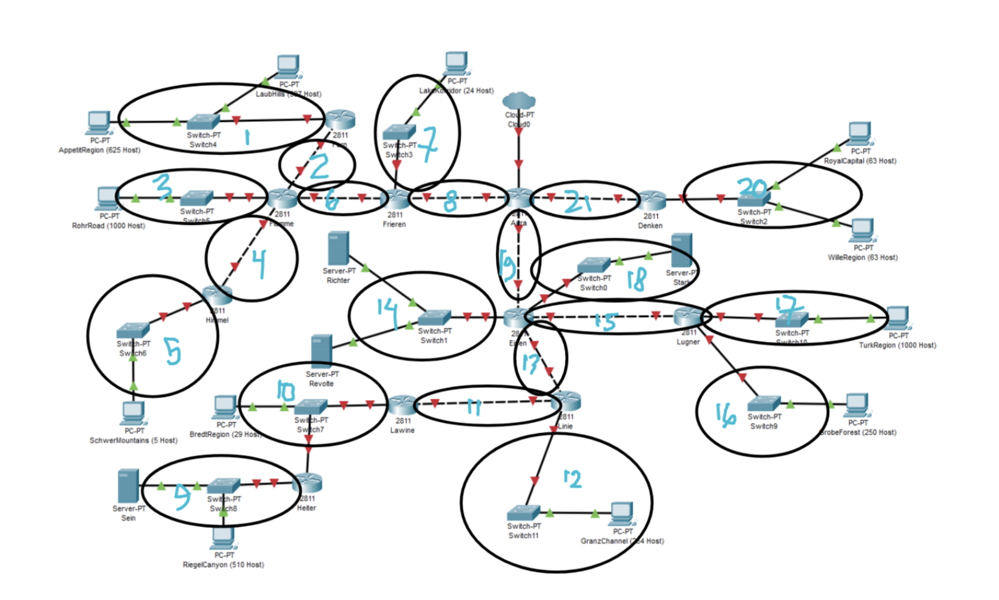

# Praktikum Modul 4 Jaringan Komputer

# Anggota Kelompok E27 :
| No.  | Nama Anggota       | NRP          |
|------|--------------------|--------------|
| 1    |Rachman Ridwan       | 5025201061   |
| 2    | Akmal Nafis         | 5025211216   |

# Topologi

# VLSM
## Menentukan jumlah IP dan plotting Subnet
- Menentukan jumlah IP yang dibutuhkan

- Plotting Subnet

# CIDR
# Kesulitan dan masalah
