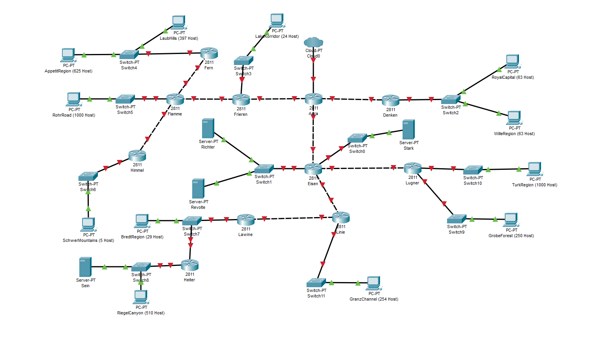
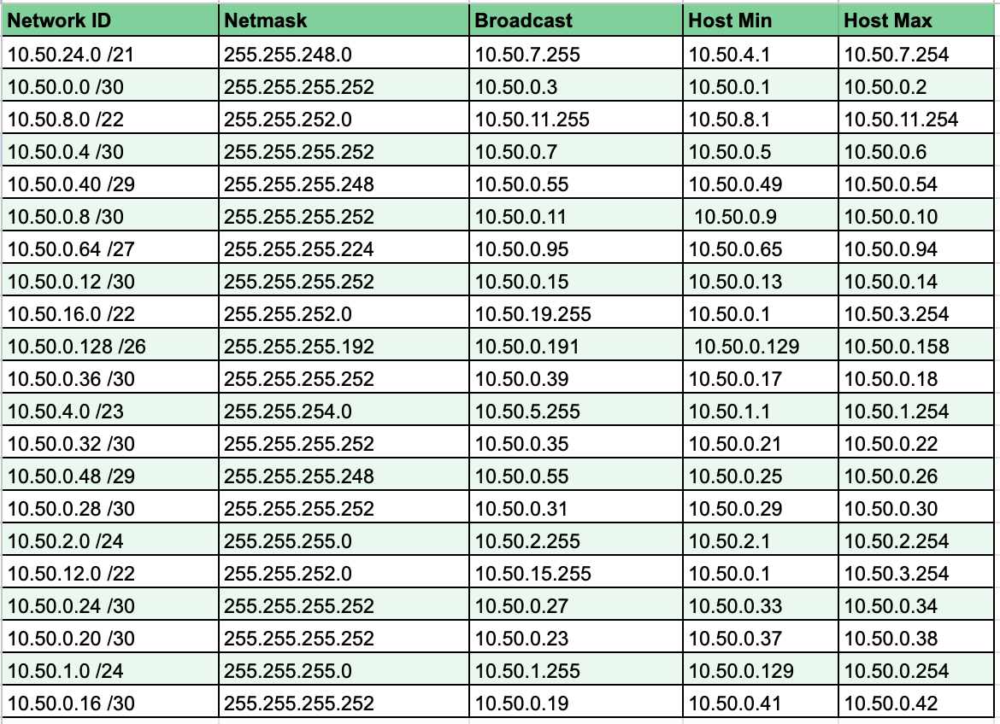

# Praktikum Modul 4 Jaringan Komputer

# Anggota Kelompok E27 :
| No.  | Nama Anggota       | NRP          |
|------|--------------------|--------------|
| 1    |Rachman Ridwan       | 5025201061   |
| 2    | Akmal Nafis         | 5025211216   |

# Topologi



# VLSM
## Menentukan jumlah IP dan plotting Subnet
- Menentukan jumlah IP yang dibutuhkan


- Plotting Subnet


## Tree & NID & Broadcast ID
- Tree Pembagian IP Address


- Penentuan NID, Broadcast ID


## Topologi dan Konfigurasi CPT
- Topologi


- Konfigurasi


## Testing
test


# CIDR
## Penggabungan Subnet


## Penggabungan 


##Pembagian IP address


Didapatkan NID, netmask, dan broadcast berikut pada masing masing subnet


## Konfigurasi IP GNS3


### Frieren 

```
auto lo
iface lo inet loopback

auto eth0
iface eth0 inet static
address 10.50.128.2
netmask 255.255.255.252
gateway 10.50.128.1

auto eth1
iface eth1 inet static
address 10.50.32.1
netmask 255.255.255.252

auto eth2
iface eth2 inet static
address 10.50.64.1
netmask 255.255.255.252
```

### LakeKorridor

```
auto eth0
iface eth0 inet static
address 10.50.64.2
netmask 255.255.255.252
gateway 10.50.64.1
```

### Flamme 

```
auto lo
iface lo inet loopback

auto eth0
iface eth0 inet static
address 10.50.32.2
netmask 255.255.255.252
gateway 10.50.32.1

auto eth1
iface eth1 inet static
address 10.50.4.1
netmask 255.255.252.0

auto eth2
iface eth2 inet static
address 10.50.24.1
netmask 255.255.255.252

auto eth3
iface eth3 inet static
address 10.50.0.9
netmask 255.255.255.252
```

### Fren 

```
auto lo

iface lo inet loopback
auto eth0
iface eth0 inet static
address 10.50.24.2
netmask 255.255.255.252
gateway 10.50.24.1

auto eth1
iface eth1 inet static
address 10.50.16.1
netmask 255.255.248.0
```

### LaubHills (

```
auto eth0
iface eth0 inet static
address 10.50.16.3
netmask 255.255.248.0
gateway 10.50.16.1
```

### RohrRoad 

```
auto eth0
iface eth0 inet static
address 10.50.4.2
netmask 255.255.252.0
gateway 10.50.4.1
```

### Himmel 

```
auto lo
iface lo inet loopback

auto eth0
iface eth0 inet static
address 10.50.0.10
netmask 255.255.255.252
gateway 10.50.0.9

auto eth1
iface eth1 inet static
address 10.50.0.1
netmask 255.255.255.248
```

### SchwerMountains 

```
auto eth0
iface eth0 inet static
address 10.50.0.2
netmask 255.255.255.248
gateway 10.50.0.1
```


### AppetitRegion 

```
auto eth0
iface eth0 inet static
address 10.50.16.2
netmask 255.255.248.0
gateway 10.50.16.1
```


### Stark 

```
auto eth0
iface eth0 inet static
address 10.51.80.2
netmask 255.255.255.252
gateway 10.51.80.1
```

### Ritcher 

```
auto eth0
iface eth0 inet static
address 10.51.96.2
netmask 255.255.255.252
gateway 10.51.96.1
```

### Revolte 

```
auto eth0
iface eth0 inet static
address 10.51.96.3
netmask 255.255.255.252
gateway 10.51.96.1
```
### TurkRegion 

```
auto eth0
iface eth0 inet static
address 10.51.64.2
netmask 255.255.252.0
gateway 10.51.64.1
```

### Lugner

```
auto lo
iface lo inet loopback

auto eth0
iface eth0 inet static
address 10.51.72.2
netmask 255.255.255.252
gateway 10.51.72.1

auto eth1
iface eth1 inet static
address 10.51.64.1
netmask 255.255.252.0

auto eth2
iface eth2 inet static
address 10.51.68.1
netmask 255.255.255.0
```


### Lawine 

```
auto lo
iface lo inet loopback

auto eth0
iface eth0 inet static
address 10.51.8.2
netmask 255.255.255.252
gateway 10.51.8.1

auto eth1
iface eth1 inet static
address 10.51.4.1
netmask 255.255.255.192
```

### GrobeForest 

```
auto eth0
iface eth0 inet static
address 10.51.68.2
netmask 255.255.255.0
gateway 10.51.68.1
```

### Linie 

```
auto lo
iface lo inet loopback

auto eth0
iface eth0 inet static
address 10.51.32.2
netmask 255.255.255.252
gateway 10.51.32.1

auto eth1
iface eth1 inet static
address 10.51.16.1
netmask 255.255.254.0

auto eth2
iface eth2 inet static
address 10.51.8.1
netmask 255.255.255.252
```

### GranzChannel 

```
auto eth0
iface eth0 inet static
address 10.51.16.2
netmask 255.255.254.0
gateway 10.51.16.1
```
### Riegel Canyon 

```
auto eth0
iface eth0 inet static
address 10.51.0.3
netmask 255.255.252.0
gateway 10.51.0.1
```


### BredtRegion 

```
auto eth0
iface eth0 inet static
address 10.51.4.2
netmask 255.255.255.192
gateway 10.51.4.1
```

### Heiter 
```
auto lo
iface lo inet loopback

auto eth0
iface eth0 inet static
address 10.51.4.3
netmask 255.255.255.192
gateway 10.51.4.1

auto eth1
iface eth1 inet static
address 10.51.0.1
netmask 255.255.252.0
```

### Sein

```
auto eth0
iface eth0 inet static
address 10.51.0.2
netmask 255.255.252.0
gateway 10.51.0.1
```

### Aura 

```
auto lo
iface lo inet loopback

auto eth0
iface eth0 inet dhcp

auto eth1
iface eth1 inet static
address 10.50.128.1
netmask 255.255.255.252

auto eth2
iface eth2 inet static
address 10.52.1.1
netmask 255.255.255.252

auto eth3
iface eth3 inet static
address 10.51.128.1
netmask 255.255.255.252
```

### Denken 

```
auto lo
iface lo inet loopback

auto eth0
iface eth0 inet static
address 10.52.1.2
netmask 255.255.255.252
gateway 10.52.1.1

auto eth1
iface eth1 inet static
address 10.52.0.1
netmask 255.255.255.0
```

### Eisen 

```
auto lo
iface lo inet loopback

auto eth0
iface eth0 inet static
address 10.51.128.2
netmask 255.255.255.252
gateway 10.51.128.1

auto eth1
iface eth1 inet static
address 10.51.80.1
netmask 255.255.255.252

auto eth2
iface eth2 inet static
address 10.51.72.1
netmask 255.255.255.252

auto eth3
iface eth3 inet static
address 10.51.32.1
netmask 255.255.255.252

auto eth4
iface eth4 inet static
address 10.51.96.1
netmask 255.255.255.252
```

### RoyalCapital 

```
auto eth0
iface eth0 inet static
address 10.52.0.2
netmask 255.255.255.0
gateway 10.52.0.1
```

### WillieRegion 

```
auto eth0
iface eth0 inet static
address 10.52.0.3
netmask 255.255.255.0
gateway 10.52.0.1
```

## Routing
- menggunakan .bashrc
### Aura

```
iptables -t nat -A POSTROUTING -o eth0 -j MASQUERADE -s 10.50.0.0/14
# A1
route add -net 10.50.16.0 netmask 255.255.248.0 gw 10.50.128.2
# A2
route add -net 10.50.24.0 netmask 255.255.255.252 gw 10.50.128.2
# A3
route add -net 10.50.4.0 netmask 255.255.252.0 gw 10.50.128.2
# A4
route add -net 10.50.0.8 netmask 255.255.255.252 gw 10.50.128.2
# A5
route add -net 10.50.0.0 netmask 255.255.255.248 gw 10.50.128.2
# A6
route add -net 10.50.32.0 netmask 255.255.255.252 gw 10.50.128.2
# A7
route add -net 10.50.64.0 netmask 255.255.255.252 gw 10.50.128.2
# A8
route add -net 10.50.128.0 netmask 255.255.255.252 gw 10.50.128.2
# A9
route add -net 10.51.0.0 netmask 255.255.252.0 gw 10.51.128.2
# A10
route add -net 10.51.4.0 netmask 255.255.255.192 gw 10.51.128.2
# A11
route add -net 10.51.8.0 netmask 255.255.255.252 gw 10.51.128.2
# A12
route add -net 10.51.16.0 netmask 255.255.254.0 gw 10.51.128.2
# A13
route add -net 10.51.32.0 netmask 255.255.255.252 gw 10.51.128.2
# A14
route add -net 10.51.96.0 netmask 255.255.255.252 gw 10.51.128.2
# A15
route add -net 10.51.72.0 netmask 255.255.255.252 gw 10.51.128.2
# A16
route add -net 10.51.68.0 netmask 255.255.255.0 gw 10.51.128.2
# A17
route add -net 10.51.64.0 netmask 255.255.252.0 gw 10.51.128.2
# A18
route add -net 10.51.80.0 netmask 255.255.255.252 gw 10.51.128.2
# A 19
route add -net 10.51.128.0 netmask 255.255.255.252 gw 10.51.128.2
# A21
route add -net 10.52.1.0 netmask 255.255.255.252 gw 10.52.1.2
# A20
route add -net 10.52.0.0 netmask 255.255.255.0 gw 10.52.1.2
```

### Eisen

```
echo nameserver 192.168.122.1 > /etc/resolv.conf
route add -net 0.0.0.0 netmask 0.0.0.0 gw 10.51.128.1

#A15
route add -net 10.51.72.0 netmask 255.255.255.252 gw 10.51.72.2
#A17
route add -net 10.51.64.0 netmask 255.255.252.0 gw 10.51.72.2
#A16
route add -net 10.51.68.0 netmask 255.255.255.0 gw 10.51.72.2
#A13
route add -net 10.51.32.0 netmask 255.255.255.252 gw 10.51.32.2
#A12
route add -net 10.51.16.0 netmask 255.255.254.0 gw 10.51.32.2
#A11
route add -net 10.51.8.0 netmask 255.255.255.252 gw 10.51.32.2
#A10
route add -net 10.51.4.0 netmask 255.255.255.192 gw 10.51.32.2
#A9
route add -net 10.51.0.0 netmask 255.255.252.0 gw 10.51.32.2
```


### Himmel

```
echo nameserver 192.168.122.1 > /etc/resolv.conf
route add -net 0.0.0.0 netmask 0.0.0.0 gw 10.50.0.9
```


### Fren

```
echo nameserver 192.168.122.1 > /etc/resolv.conf
route add -net 0.0.0.0 netmask 0.0.0.0 gw 10.50.24.1
```

### Flamme

```
echo nameserver 192.168.122.1 > /etc/resolv.conf
route add -net 0.0.0.0 netmask 0.0.0.0 gw 10.50.32.1

route add -net 10.50.24.0 netmask 255.255.255.252 gw 10.50.24.2
route add -net 10.50.16.0 netmask 255.255.248.0 gw 10.50.24.2
route add -net 10.50.0.8 netmask 255.255.255.252 gw 10.50.0.10
route add -net 10.50.0.0 netmask 255.255.255.248 gw 10.50.0.10

```

### Frieren

```
echo nameserver 192.168.122.1 > /etc/resolv.conf
route add -net 0.0.0.0 netmask 0.0.0.0 gw 10.50.128.1

route add -net 10.50.16.0 netmask 255.255.248.0 gw 10.50.32.2
route add -net 10.50.24.0 netmask 255.255.255.252 gw 10.50.32.2
route add -net 10.50.4.0 netmask 255.255.252.0 gw 10.50.32.2
route add -net 10.50.0.8 netmask 255.255.255.252 gw 10.50.32.2
route add -net 10.50.0.0 netmask 255.255.255.248 gw 10.50.32.2
route add -net 10.50.32.0 netmask 255.255.255.252 gw 10.50.32.2
```

### Lawine

```
echo nameserver 192.168.122.1 > /etc/resolv.conf
route add -net 0.0.0.0 netmask 0.0.0.0 gw 10.51.8.1
route add -net 10.51.4.0 netmask 255.255.255.192 gw 10.51.4.3
route add -net 10.51.0.0 netmask 255.255.252.0 gw 10.51.4.3
```

### Linie

```
echo nameserver 192.168.122.1 > /etc/resolv.conf
route add -net 0.0.0.0 netmask 0.0.0.0 gw 10.51.32.1

route add -net 10.51.8.0 netmask 255.255.255.252 gw 10.51.8.2
route add -net 10.51.4.0 netmask 255.255.255.192 gw 10.51.8.2
route add -net 10.51.0.0 netmask 255.255.252.0 gw 10.51.8.2
```

### Heiter

```
echo nameserver 192.168.122.1 > /etc/resolv.conf
route add -net 0.0.0.0 netmask 0.0.0.0 gw 10.51.4.1
```

### Lugner

```
echo nameserver 192.168.122.1 > /etc/resolv.conf
route add -net 0.0.0.0 netmask 0.0.0.0 gw 10.51.72.1
```

### Denken

```
echo nameserver 192.168.122.1 > /etc/resolv.conf
route add -net 0.0.0.0 netmask 0.0.0.0 gw 10.52.1.1
```

### Test


- RiegelCanyon - GranzChannel


# Kesulitan dan masalah
